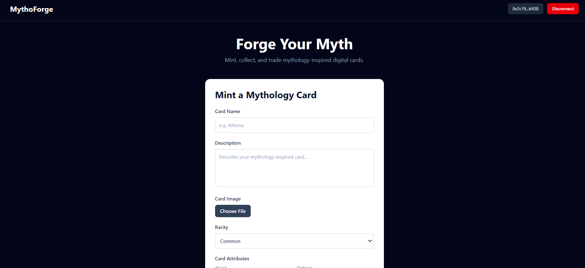
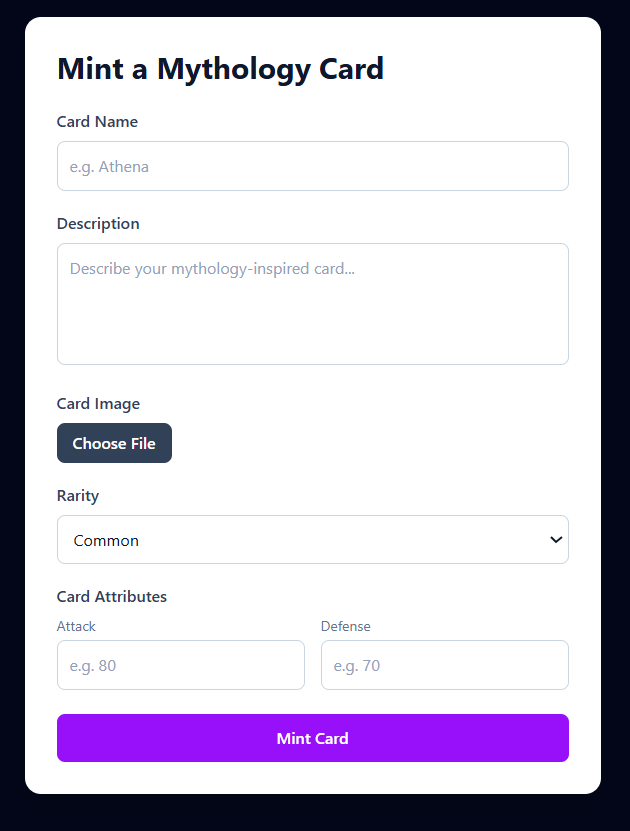
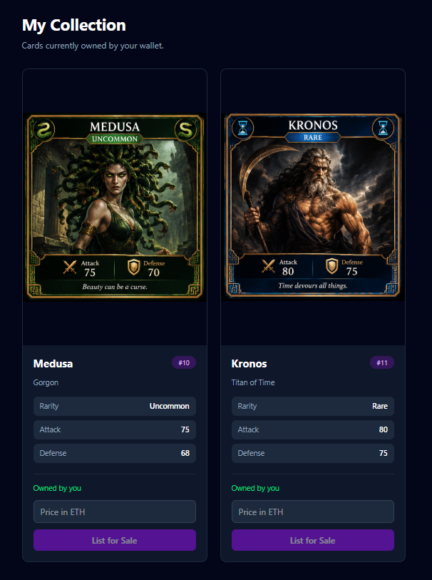
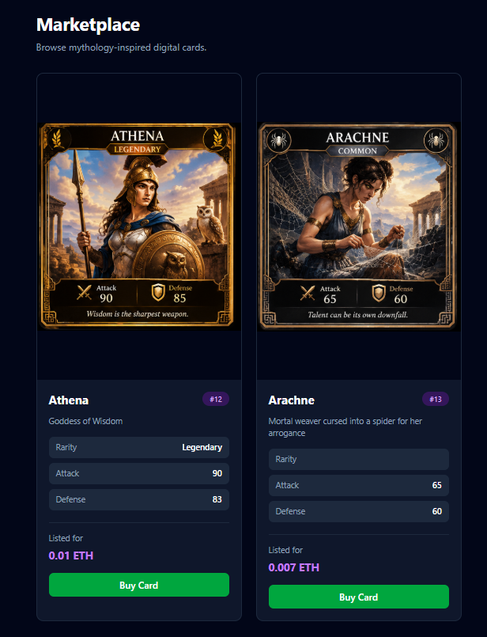

# MythoForge

MythoForge is a decentralized marketplace for unique Greek Mythology-inspired digital game cards.

The application allows users to connect their MetaMask wallet, mint ERC-721 cards, store card images and metadata on IPFS, list cards for sale, purchase listed cards using Sepolia ETH, and manage their NFT collection.

The project is built as a blockchain-based application using Ethereum Sepolia, Solidity, OpenZeppelin, React, ethers.js, and IPFS through Pinata.

---

## Project Overview

MythoForge demonstrates how NFTs can be used to represent unique digital game cards and how a decentralized marketplace can be built around them.

Each card is represented by an ERC-721 token with its own token ID and metadata. Card images and metadata are stored using IPFS, while ownership and marketplace transactions are handled by the Ethereum smart contract.

### Main Features

- Connect a MetaMask wallet
- Mint unique ERC-721 digital game cards
- Add card name and description
- Assign card attributes:
  - Rarity
  - Attack
  - Defense
- Upload card images to IPFS
- Store card metadata on IPFS
- View cards owned by the connected wallet
- List owned cards for sale
- Purchase listed cards using Sepolia ETH
- Cancel active listings
- View active cards in the marketplace
- Display transaction progress and error messages
- Smart contract tests for core marketplace functionality

---

## Tech Stack

### Blockchain

- Ethereum Sepolia Testnet
- Solidity
- ERC-721
- OpenZeppelin

### Smart Contract Development

- Hardhat 3
- ethers.js
- Mocha
- Chai

### Frontend

- React
- TypeScript
- Vite
- Tailwind CSS
- ethers.js
- MetaMask

### Backend

- Node.js
- Express

### Decentralized Storage

- IPFS
- Pinata

---

## Application Workflow

The main workflow of MythoForge is:

```text
                    MetaMask Wallet
                          |
                          v
                    MythoForge UI
                          |
          +---------------+---------------+
          |               |               |
          v               v               v
       Mint Card      Marketplace     My Collection
          |               |               |
          v               v               v
       IPFS/Pinata    Buy / List /     NFT Ownership
       Image +        Cancel Listing     & Listings
       Metadata           |
          |               |
          +-------+-------+
                  |
                  v
           Ethereum Sepolia
            Smart Contract
```

## IPFS Implementation:

MythoForge uses IPFS to store NFT images and metadata.

Pinata is used as the IPFS service for uploading the files.

### Card Image Upload

When a user mints a card:

The card image is selected in the frontend.
The frontend requests an upload URL from the backend.
The image is uploaded to Pinata/IPFS.
The resulting IPFS CID is obtained.

The image is referenced using an IPFS URI:

ipfs://<image-CID>
### Metadata Upload

After the image is uploaded, MythoForge creates metadata containing information such as:

Card name
Description
Image URI
Rarity
Attack
Defense

The metadata is then uploaded to IPFS through Pinata.

The resulting metadata URI is passed to the ERC-721 smart contract when the NFT is minted.

The overall process is:

Card Image
     |
     v
Pinata / IPFS
     |
     v
Image CID
     |
     v
Card Metadata
     |
     v
Pinata / IPFS
     |
     v
Metadata CID
     |
     v
ERC-721 Token URI

The Pinata JWT is handled by the backend rather than being exposed directly in the frontend.


### Smart Contract:

The main smart contract is:

contracts/MythoForge.sol

The contract implements an ERC-721 NFT marketplace using OpenZeppelin.

### Core Functions

The smart contract provides functionality for:

Minting cards
Listing cards
Buying listed cards
Cancelling listings
Tracking listings
Transferring NFT ownership
Emitting marketplace events

The marketplace uses ETH for purchases.


## Testnet & Contract Address

MythoForge is deployed on the Ethereum Sepolia Testnet.

| Property | Value |
|---|---|
| Network | [Ethereum Sepolia](https://sepolia.etherscan.io/) |
| Chain ID | `11155111` |
| Contract | MythoForge |
| Contract Address | [`0xaA7f0A43212De0AA9b3d499750e8861b320057b6`](https://sepolia.etherscan.io/address/0xaA7f0A43212De0AA9b3d499750e8861b320057b6) |

The contract is deployed and can be verified on Sepolia Etherscan.


## Setup Instructions:
### Prerequisites

Install the following:

Node.js
npm
MetaMask
Git

A MetaMask wallet configured for Ethereum Sepolia is required to interact with the application.

You will also need Sepolia ETH for testing blockchain transactions.

1. Clone the Repository
git clone <repository-url>
cd MythoForge
2. Install Smart Contract Dependencies

From the project root:

npm install
3. Install Frontend Dependencies
cd frontend
npm install
4. Install Backend Dependencies
cd ../server
npm install


## Running the Application:
### Start the Backend

From the server directory:

node index.js

The backend runs locally and provides the functionality required by the frontend for IPFS-related operations.

### Start the Frontend

Open another terminal and run:

cd frontend
npm run dev

Vite will provide a local development URL.

Open the URL in your browser and connect MetaMask to Ethereum Sepolia.


## Smart Contract Testing:

The project includes automated tests for the core marketplace functionality.

From the project root:

npx hardhat test

The current test suite contains 8 passing tests covering:

NFT minting
NFT listing
NFT purchasing
Listing cancellation

These tests verify the core smart-contract behavior independently of the frontend.


## Project Structure:
MythoForge/
│
├── contracts/
│   └── MythoForge.sol
│
├── frontend/
│   └── src/
│       ├── components/
│       │   ├── Marketplace.tsx
│       │   ├── MintCard.tsx
│       │   └── MyCollection.tsx
│       │
│       └── contracts/
│           ├── MythoForgeABI.ts
│           └── contract.ts
│
├── scripts/
│   ├── deploy.ts
│   └── send-op-tx.ts
│
├── server/
│   ├── index.js
│   ├── package.json
│   └── package-lock.json
│
├── test/
│   └── MythoForge.ts
│
├── hardhat.config.ts
├── package.json
├── package-lock.json
├── tsconfig.json
└── README.md


## Screenshots

### Home Page



### Mint Card



### My Collection



### Marketplace




## License:

This project was developed as a student project for educational and demonstration purposes.